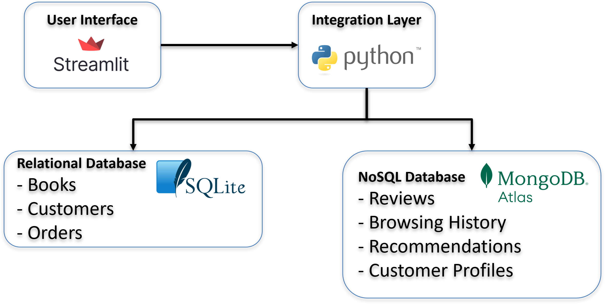
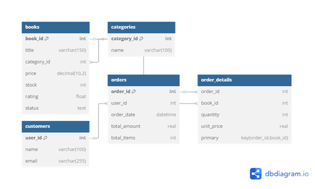
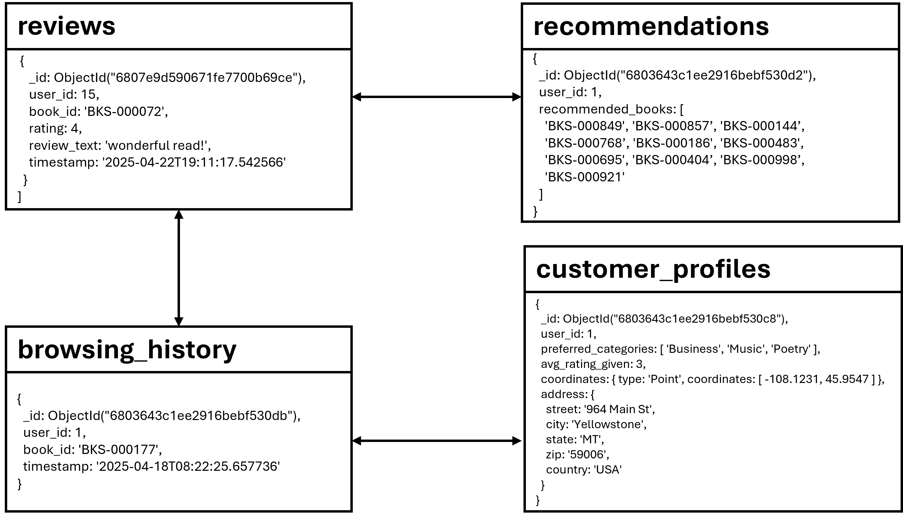

# Hybrid Bookstore Database System

A hybrid bookstore system that combines the strengths of relational (SQL) and non-relational (MongoDB) databases.  
Users can browse, order, and review books — while admins monitor customer locations and activities through dashboards.  
Built using **Streamlit** for a lightweight, interactive web interface.

---

## Table of Contents
- [Features](#features)
- [Tech Stack](#tech-stack)
- [Folder Structure](#folder-structure)
- [System Architecture](#system-architecture)
- [Database Schema Overview](#database-schema-overview)
- [Setup Instructions](#setup-instructions)
- [Environment Setup & Dependencies](#environment-setup--dependencies)
- [Usage](#usage)
- [Hybrid Bookstore User Actions Overview](#hybrid-bookstore-user-actions-overview)
- [Acknowledgments](#acknowledgments)
- [Authors](#authors)
- [License](#license)

---

## Features
- Guest browsing and book ordering without account creation
- Customer accounts with:
  - Profile management
  - Book browsing and ordering
  - Submitting and viewing reviews
  - Receiving dynamic personalized recommendations
- Admin dashboards for monitoring customer activities and geographic distribution
- SQL database for managing structured data (Books, Customers, Orders)
- MongoDB Atlas for handling flexible, user-generated data (Reviews, Browsing History, Recommendations, Profiles)
- Geolocation queries using MongoDB for customer mapping and nearby searches

---

## Tech Stack
- **Frontend:** Streamlit
- **Relational Database:** SQLite
- **NoSQL Database:** MongoDB Atlas
- **Backend Scripting:** Python (Pandas, PyMongo, SQLite3, etc.)
- **Geolocation:** Google Maps API, MongoDB 2dsphere index
- **Visualization:** Folium (maps)

---

## Folder Structure
```bash
hybrid-bookstore/
|
├── app/                         # Streamlit frontend application
│   └── main.py                  # Main user interface and page logic
|
├── db/                          # Databases and supporting setup
│   ├── mongo/
│   │   └── indexes.py            # MongoDB index creation script
│   └── sql/
│       ├── hybrid_bookstore.db   # SQLite database file (generated)
│       └── schema.sql            # SQL schema for tables
|
├── scripts/                     # Backend logic
│   ├── CRUD operations           # (e.g., books, orders, customers)
│   ├── Integration scripts       # Link SQL and MongoDB data
│   └── Data loaders              # Scripts to load CSV/JSON into databases
|
├── data/                         # Initial datasets
│   ├── books.csv
│   ├── categories.csv
│   ├── customers.csv
│   ├── orders.csv
│   ├── order_details.csv
│   ├── browsing_history.json
│   ├── customer_profiles.json
│   ├── recommendations.json
│   └── reviews.json
|
├── .env                          # Environment variables (MongoDB URI, API keys) - NOT versioned
├── .gitignore                    # Files/folders to ignore in version control
├── requirements.txt              # Python dependency list
└── README.md                     # Project documentation (this file)
```

---
## System Architecture



**Figure 1:**  
*Hybrid Bookstore System Architecture.*  
The system consists of a Streamlit-based frontend connected to a Python integration layer, which manages interactions with both a relational database (SQLite) for structured data and a NoSQL database (MongoDB Atlas) for flexible, user-centric data.

---
## Database Schema Overview

### Relational Database (SQLite)
[View SQL Schema Diagram on dbdiagram.io](https://dbdiagram.io/d/67ffd4ab1ca52373f54439ea)



**Figure 2:**  
*Entity-Relationship (ER) diagram for the relational SQLite database used in the hybrid bookstore system.*  
The schema captures books, categories, customers, orders, and order details, with proper foreign key relationships.


### NoSQL Database (MongoDB Atlas)

**Figure 3:**  
*Document model for MongoDB collections in the hybrid bookstore system.*  
Each collection references core entities using shared identifiers (`user_id`, `book_id`) linked to SQL data.  
Arrows indicate logical relationships that support recommendations, user behavior tracking, and personalization features.

---
## Setup Instructions

### 1. Clone the repository
```bash
git clone https://github.com/yourusername/hybrid-bookstore.git
cd hybrid-bookstore
```

### 2. Set up the environment
```bash
pip install -r requirements.txt
```

Create a `.env` file:
```env
MONGO_URI=your_mongodb_uri
GOOGLE_API_KEY=your_google_maps_api_key
```

### 3. Set up the databases

Load SQL data:
```bash
python scripts/load_sql_tables.py
```

Load MongoDB data:
```bash
python scripts/load_to_mongodb_atlas.py
```

(Optionally) Set up MongoDB indexes:
```bash
python db/mongo/indexes.py
```

### 4. Run the application
```bash
streamlit run app/main.py
```

Access the app at `http://localhost:8501/`

---

## Environment Setup & Dependencies

This project was developed using a Python virtual environment to isolate dependencies and ensure consistent behavior across systems.  
All required packages are listed in the `requirements.txt` file.

### Key Python Packages

| Package        | Purpose                                        |
|:---------------|:-----------------------------------------------|
| `streamlit`     | Frontend UI for user interaction               |
| `pymongo`       | Communication with MongoDB Atlas              |
| `pandas`        | Data manipulation and table display           |
| `folium`        | Interactive maps for geolocation dashboards   |
| `requests`      | API communication (e.g., Google Maps API)     |
| `python-dotenv` | Load environment variables from `.env` files  |
| `watchdog`, `gitpython` | Internal dependencies for Streamlit operation |

### Sample `requirements.txt`
```bash
streamlit==1.44.1
pymongo==4.12.0
pandas==2.2.2
folium==0.14.0
requests==2.32.3
python-dotenv==1.0.1
```

> (Full list of dependencies available in the provided `requirements.txt` file.)

### Reproducing the Environment

To install all dependencies in a new environment, simply run:
```bash
pip install -r requirements.txt
```

A `.venv/` folder was used locally for development and is excluded from version control using `.gitignore`.

---

## Usage

- **Guests:** Browse books and place orders without logging in.
- **Customers:** View their profile, orders, submit reviews, and get personalized recommendations.
- **Admins:** Monitor customer activities, view customer maps, and access basic reporting dashboards.

---

## Hybrid Bookstore User Actions Overview

### Detailed User Actions

| Action | Databases Used | Query Type | Who Interacts | Description |
|:---|:---|:---|:---|:---|
| **Browse Books** | SQL (SQLite) | SELECT | Customer, Guest | Selects a book category and views available books. "Add to Order" saves selected books temporarily in session state. |
| **View Full Book Details** | MongoDB | INSERT (Browsing History) | Customer, Guest | When users choose to view full book details during browsing, the interaction is logged into the browsing_history collection in MongoDB for future personalization and analytics. |
| **Place Order** | SQL (SQLite) | INSERT | Customer, Guest | Guests enter shipping details during checkout (auto-registering as customers). Existing customers place orders using saved profiles. Orders and order details recorded in SQL. |
| **View Profile** | MongoDB + SQL (SQLite) | Simple Find Query | Customer | Displays user's profile information (name, email, address, preferred categories, average rating) on the Home page. |
| **Submit Review** | MongoDB + SQL (SQLite) | INSERT (MongoDB), UPDATE (SQL) | Customer | Submits a review for a previously purchased book that has not yet been reviewed. The review is inserted into MongoDB, and the book's average rating is recalculated and updated in SQL. |
| **View Recommendations** | MongoDB | Aggregation Pipeline | Customer | Views personalized book recommendations generated based on order and review history. |
| **View Past Orders** | SQL (SQLite) | SELECT | Customer | Views previous orders and order details stored in SQL. |
| **View Own Reviews** | MongoDB | Simple Find Query | Customer | Views their submitted reviews from MongoDB. |
| **View Customer and Book Stats** | SQL (SQLite) | SELECT | Admin | Views statistics: number of customers, states covered, categories, books. |
| **View Dashboards (Maps)** | MongoDB | Geospatial Queries (2dsphere) | Admin | Visualizes customer locations on a map, filters by ratings, and finds nearby customers. |

---
## Acknowledgments
- Datasets adapted from [Kaggle](https://www.kaggle.com/)
- Technologies: Streamlit, MongoDB Atlas, Google Maps API, SQLite

---

## Authors
- **Anna Bajszczak**

---

## License

This project was developed as part of the **NoSQL Database** course at **Purdue University**.  
It is intended for **educational use and demonstration purposes only**.  
**All rights reserved.**

---
